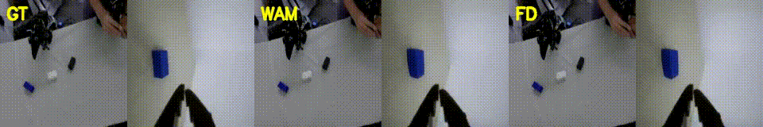
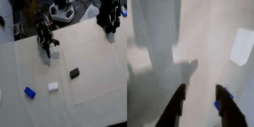

# cosmos-edge-lab

**基于 Cosmos3-Edge 的个人世界动作模型（WAM）实验仓库** —— 不是别人配方的简单拷贝。

所有者：[upnana](https://github.com/upnana)  
远程仓库：https://github.com/upnana/cosmos-edge-lab

本仓库负责：

- 实验问题、假设与运行记录
- SO-101 / 三相机叠块数据的适配与归一化
- 面向 **1×H100 + Cosmos3-Edge** 调好的视觉微调 / 动作策略 TOML
- 启动与转换脚本

**不**包含训练引擎核心。训练仍通过本地
[NVIDIA cosmos-framework](https://github.com/NVIDIA/cosmos-framework)
（默认：`../cosmos-framework`）运行。本仓库补丁用 `scripts/sync_patches.sh` 同步进去。

```
cosmos-edge-lab/          ← 你的实验与记录
../cosmos-framework/      ← 训练/推理引擎（外部依赖）
```

## 首个实验：`stack3cam_wam`

数据：SO-101 真机遥操作数据集 `stack_3blocks_white_blue_black_3cam`（LeRobot v3，三路相机，6 维关节）。

同一底座（**Cosmos3-Edge**）上两条线：

1. **视觉微调（Vision SFT）** —— 以前视为主，学世界 / 视频动力学  
2. **动作策略微调（Action-policy SFT）** —— 世界动作模型风格；前视 + 腕部拼图

### 文档索引

| 文档 | 主题 |
|------|------|
| [`docs/RESULTS_SUMMARY.md`](docs/RESULTS_SUMMARY.md) | **结果汇总**（视觉预测 + 动作 WAM/FD） |
| [`docs/BENCH_PC_REAL_ROBOT_STEP_BY_STEP.md`](docs/BENCH_PC_REAL_ROBOT_STEP_BY_STEP.md) | **真机闭环逐步手册**（下权重→域名→相机→空跑→冷/热启动→踩坑→反归一化→评测） |
| [`docs/REAL_ROBOT_EVAL_CHECKLIST.md`](docs/REAL_ROBOT_EVAL_CHECKLIST.md) | **真机成功率检查清单** + 离线/真机 rollout 骨架 |
| [`docs/BENCH_PC_OFFLINE_INFERENCE.md`](docs/BENCH_PC_OFFLINE_INFERENCE.md) | **离线推理**（HF 导出、domain=22、前视\|腕部@256、反归一化） |
| [`docs/RESOLUTION_CONFIG.md`](docs/RESOLUTION_CONFIG.md) | **分辨率**：采集 640×480 vs 策略输入 256×256；仿真/论文怎么写 |
| [`docs/GPU_MONITOR.md`](docs/GPU_MONITOR.md) | 训练/评测 GPU 利用率与显存采样 |
| [`docs/ACTION_POLICY_OFFLINE_WAM.md`](docs/ACTION_POLICY_OFFLINE_WAM.md) | 动作策略离线 WAM/FD（第 111 条轨迹） |
| [`docs/ACTION_POLICY_WAM_MORE.md`](docs/ACTION_POLICY_WAM_MORE.md) | 更多留出集 WAM/FD（约 1s / 3s / 8s） |
| [`docs/VISION_500_HELDOUT_I2V.md`](docs/VISION_500_HELDOUT_I2V.md) | 视觉 500 步留出集图生视频 |
| [`docs/EXPERIMENT_DESIGN.md`](docs/EXPERIMENT_DESIGN.md) | 假设与成功标准 |
| [`docs/COSMOS_ARCHITECTURE.md`](docs/COSMOS_ARCHITECTURE.md) | Cosmos3 MoT / Edge 网络结构 |
| [`docs/MOT_ATTENTION_AND_VISION_SFT.md`](docs/MOT_ATTENTION_AND_VISION_SFT.md) | MoT 注意力与视觉微调训哪些模块 |
| [`docs/VISION_VS_ACTION_SFT.md`](docs/VISION_VS_ACTION_SFT.md) | 视觉与动作如何分别训练 |
| [`docs/CODE_MAP.md`](docs/CODE_MAP.md) | 代码位置 / 改哪里 |
| [`docs/FULL_SFT_VS_LORA.md`](docs/FULL_SFT_VS_LORA.md) | 全量微调 vs LoRA |
| [`docs/VISION_SMOKE_EXPORT_I2V.md`](docs/VISION_SMOKE_EXPORT_I2V.md) | 视觉冒烟→导出→图生视频（页内可预览） |
| [`notes/analysis_2026-08-10.md`](notes/analysis_2026-08-10.md) | 会话纪要 |

配方目录：[`experiments/stack3cam_wam/`](experiments/stack3cam_wam/)

对照基线（同任务、不同模型族）：π0 三相机（`upna/pi0_stack_white_blue_black_3cam_*`）。

### 名词（先分清）

| 中文说法 | 英文习惯叫法 | 本实验里指什么 |
|----------|--------------|----------------|
| 优化步 / 迭代 | iter / step | 优化器更新次数。动作策略权重对应 **`iter_000002000`（第 2000 步）**，不要说成「训练了 2000 个 epoch」 |
| 训练轮次 | epoch | 把训练集完整扫一遍；本配方存盘主要用 **iter**，README 不单独报 epoch |
| 轨迹 / 片段 | episode（ep） | 数据集里一条遥操作录像。离线评测主看 **ep111**（留出集 / 验证） |
| 真机试次 | trial | **真机**闭环的一次摆场评测（和数据集 ep 编号不是一回事） |
| 动作块长度 | chunk | 一次预测多少步动作；训练为 **32**（约 1.1 秒 @30fps）；评测还可外推 96 / 240 |
| 真值 / 世界动作 / 前向动力学 | GT / WAM / FD | **左**：真机相机；**中**：同时预测动作+未来视频；**右**：给定真值动作、只预测未来视频 |

### 离线对比：真值 · 世界动作 · 前向动力学（推荐）

> 打开本页即可预览；完整说明见 [`docs/ACTION_POLICY_OFFLINE_WAM.md`](docs/ACTION_POLICY_OFFLINE_WAM.md)。

选用 **留出集 ep111 · 约 3.2 秒（chunk=96）**：比 1 秒更好看出叠块动态，比 8 秒更干净。  
（指标最好、且对齐训练设定的是 **约 1 秒 / chunk=32**：动作平均绝对误差 **7.62°**，视频 PSNR 约 17 dB。）

| 项 | 值 |
|----|-----|
| 检查点 | `stack3cam_action_policy_edge_2000` / **第 2000 步** |
| 评测轨迹 | **ep111**（留出集） |
| 时间窗 | 从第 274 帧起，共 97 帧 @30fps ≈ **3.2 秒** |
| 动作误差（反归一化后，度） | 17.7（比训练 chunk 更长，误差变大属预期） |
| 视频 PSNR（WAM / FD） | 约 16.9 / 16.8 dB |



<video src="docs/assets/action_wam_ep111/3s/gt_wam_fd_web.mp4" controls width="960" preload="metadata">
  请看上方动图，或
  <a href="docs/assets/action_wam_ep111/3s/gt_wam_fd_web.mp4">下载视频</a>
</video>

训练对齐的短窗（约 1 秒）预览见：[`docs/ACTION_POLICY_OFFLINE_WAM.md`](docs/ACTION_POLICY_OFFLINE_WAM.md)。

### 真机闭环预览

> 打开本页或 [`docs/assets/real_robot_eval/`](docs/assets/real_robot_eval/README.md) 即可浏览播放；  
> **不要**单独点开 `.mp4` 文件页（GitHub 经常只显示「查看原始文件」）。

热启动动作策略闭环一圈的 **相机录像**（前视\|腕部，各缩到 256；颜色通道已校正）。  
这是机械臂真实执行时的画面，**不是**模型「生成」的视频；关节动作在 `*_actions.json` 里。  
对应 **真机第 1 次试跑**（不是数据集 ep111）。



<video src="docs/assets/real_robot_eval/cosmos_action_warm_t001_eval_web.mp4" controls width="720" preload="metadata">
  请看上方动图，或
  <a href="docs/assets/real_robot_eval/cosmos_action_warm_t001_eval_web.mp4">下载视频</a>
</video>

完整步骤见 [`docs/BENCH_PC_REAL_ROBOT_STEP_BY_STEP.md`](docs/BENCH_PC_REAL_ROBOT_STEP_BY_STEP.md)。

## 环境准备

```bash
# 1) 引擎（一次性）
#    另处 clone + uv sync cosmos-framework，例如 ../cosmos-framework

# 2) 本仓库环境
cd /path/to/cosmos-edge-lab
export COSMOS_FRAMEWORK_ROOT=/path/to/cosmos-framework   # 若已是 ../cosmos-framework 可省略
source scripts/env.sh

# 3) 把 SO-101 适配补丁注入引擎
bash scripts/sync_patches.sh
```

机器上还需一次性准备：

- Wan2.2 视觉编码器权重：`$COSMOS_FRAMEWORK_ROOT/examples/checkpoints/wan22_vae/Wan2.2_VAE.pth`
- Hugging Face 底座权重：例如 `/home/july/models/Cosmos3-Edge`（可用环境变量 `EDGE_HF` 覆盖）
- 转成分布式检查点：`bash scripts/prepare_edge_dcp.sh`

## 运行手册

```bash
source scripts/env.sh

# 视觉数据（前视片段 → JSONL）
bash scripts/prepare_vision_data.sh

# 视觉冒烟训练（GPU 空闲时）
export EXTRA_TAIL_OVERRIDES="trainer.max_iter=10 checkpoint.save_iter=10"
bash scripts/launch_vision_sft.sh

# 动作策略冒烟训练
export EXTRA_TAIL_OVERRIDES="trainer.max_iter=10 checkpoint.save_iter=10 dataloader_train.max_samples_per_batch=2"
bash scripts/launch_action_policy.sh

# 更长训练：去掉 EXTRA_TAIL_OVERRIDES 再跑
```

产物在 `outputs/`（已加入 gitignore）；检查点在 `checkpoints/`。

## 目录结构

```
configs/                 # 你拥有的 TOML 配方
scripts/                 # 转换 / 同步 / 启动
patches/cosmos-framework # SO-101 数据集 + 动作实验补丁源码
experiments/stack3cam_wam
docs/                    # 设计与结果文档
notes/                   # 工作假设 / 对比记录
data/ processed/         # 仅本机数据
```

## 许可说明

`patches/` 下保留的上游 NVIDIA 文件及部分配置仍带 SPDX 头（OpenMDW）。  
本仓库的实验叙述与适配器属于个人实验库；再分发时请遵守上游许可。
