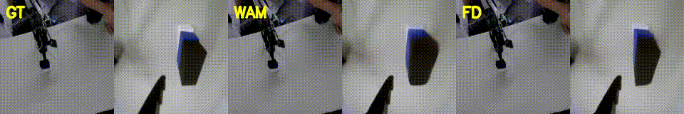
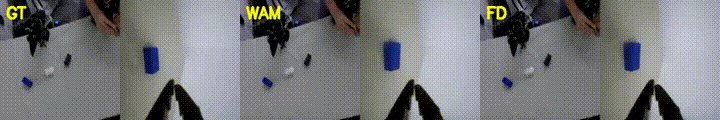

# Action-Policy 离线评测（WAM + Forward Dynamics）

> 日期：2026-08-11  
> job：`stack3cam_action_policy_edge_2000`（`iter_000002000`）  
> 评测 episode：**111**（held-out / val）  
> 设定：`domain=so101_follower`，front\|wrist concat @256，`fps=30`

**测什么：**

| 标签 | `model_mode` | 含义 |
|------|--------------|------|
| GT | — | 真机 concat 观测 |
| WAM | `wam` | 同时预测动作块 + 未来视频 |
| FD | `forward_dynamics` | 给定 **GT 动作（meanstd）**，只预测未来视频 |

入口脚本：`scripts/run_action_wam_heldout.sh`。  
完整 metrics JSON：[`1s`](assets/action_wam_ep111/1s/metrics.json) / [`3s`](assets/action_wam_ep111/3s/metrics.json) / [`8s`](assets/action_wam_ep111/8s/metrics.json)。

---

## 1. ~1.1s（chunk=32，对齐训练）

窗口：`start_frame=645`（自动最大运动；mean step L2≈5.29）

| 指标 | 值 |
|------|-----|
| Action L1（raw deg，denorm） | **7.62** |
| Action MSE（raw） | 106.5 |
| Action L1（meanstd） | **0.41** |
| WAM vision PSNR vs GT | **16.9** dB |
| FD vision PSNR vs GT | **17.3** dB |

### GT \| WAM \| FD



<video src="assets/action_wam_ep111/1s/gt_wam_fd_web.mp4" controls width="960" preload="metadata">
  <a href="assets/action_wam_ep111/1s/gt_wam_fd_web.mp4">gt_wam_fd_web.mp4</a>
</video>

---

## 2. ~3.2s（chunk=96，外推更长）

窗口：`start_frame=274`（对该 chunk 自动最大运动）

| 指标 | 值 |
|------|-----|
| Action L1（raw deg，denorm） | 17.7 |
| Action MSE（raw） | 591.6 |
| Action L1（meanstd） | 0.82 |
| WAM vision PSNR vs GT | 16.9 dB |
| FD vision PSNR vs GT | 16.8 dB |

训练只见过 chunk=32，加长后动作误差变大是预期；视频 PSNR 仍约 ~17 dB。

### GT \| WAM \| FD


<video src="assets/action_wam_ep111/3s/gt_wam_fd_web.mp4" controls width="960" preload="metadata">
  <a href="assets/action_wam_ep111/3s/gt_wam_fd_web.mp4">gt_wam_fd_web.mp4</a>
</video>

---

## 3. ~8.0s（chunk=240，长时外推）

窗口：`start_frame=273`；241 帧 @30fps ≈ **8.03s**（2026-08-12）。

| 指标 | 值 |
|------|-----|
| Action L1（raw deg，denorm） | 15.2 |
| Action MSE（raw） | 462.2 |
| Action L1（meanstd） | 0.71 |
| WAM vision PSNR vs GT | 16.0 dB |
| FD vision PSNR vs GT | 16.1 dB |

相对 1s，视频 PSNR 略降；动作仍明显粗于训练 chunk。

### GT \| WAM \| FD



<video src="assets/action_wam_ep111/8s/gt_wam_fd.mp4" controls width="960" preload="metadata">
  <a href="assets/action_wam_ep111/8s/gt_wam_fd.mp4">gt_wam_fd.mp4</a>
</video>

---

## 4. 怎么复现

```bash
source scripts/env.sh

# ~1s（默认 chunk=32）
EPISODES=111 bash scripts/run_action_wam_heldout.sh

# ~3s
EPISODES=111 CHUNK_LENGTH=96 EVAL_ROOT=$LAB_ROOT/outputs/eval_action_wam_3s \
  bash scripts/run_action_wam_heldout.sh

# ~8s（241=4n+1 帧）
EPISODES=111 CHUNK_LENGTH=240 EVAL_ROOT=$LAB_ROOT/outputs/eval_action_wam_8s \
  bash scripts/run_action_wam_heldout.sh
```

说明：

- WAM 输出在 meanstd 空间；`score_action_wam_eval.py` 会 denorm 后再报 raw L1/MSE  
- FD 条件动作使用 `actions_norm.json`（与训练一致）  
- 默认 `--auto-motion-window`，避免 episode 开头 idle 把 action MSE 测虚  

---

## 5. 解读（暂定）

离线 open-loop：动作有信号但仍粗；WAM/FD 视频都能看出桌面动力学。真机 closed-loop 与 π0 对比仍待做。详见 [`notes/action_policy_2000_showcase.md`](../notes/action_policy_2000_showcase.md)。

更多 held-out（ep 3/22/47/69/99，含 1s/3s/8s）：[`ACTION_POLICY_WAM_MORE.md`](ACTION_POLICY_WAM_MORE.md)。  
总表：[`RESULTS_SUMMARY.md`](RESULTS_SUMMARY.md)。

---

## 更多 held-out

见 [`ACTION_POLICY_WAM_MORE.md`](ACTION_POLICY_WAM_MORE.md)（ep 3/22/47/69/99）。
