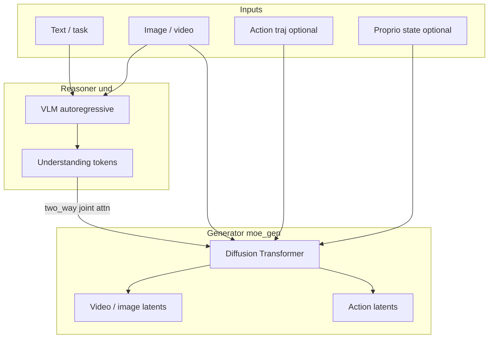

# Cosmos3 network structure (Edge-focused)

Personal lab notes for understanding what we post-train. Not a substitute for
NVIDIA’s papers/docs; aligned with `cosmos-framework` Edge configs we use.

## One-liner

Cosmos3 is a **Mixture-of-Transformers (MoT)** omnimodal model:

- **Reasoner tower (und)** — autoregressive VLM for understanding (text / image / video context).
- **Generator tower (gen / `moe_gen`)** — diffusion (rectified flow) for continuous modalities
  (video / image / action; sound optional).

Text is next-token decoded; video and actions are synthesized by iterative denoising.
`joint_attn_implementation = "two_way"` couples the two pathways with cross-attention.

## Diagram



## Cosmos3-Edge specifics

| Item | Edge |
|------|------|
| Scale | ~4B, edge-oriented |
| Backbone | **Nemotron-2B-Dense-VL** (not Qwen3-VL used by Nano/Super) |
| Video codec | **Wan2.2 VAE** (pixels ↔ latents) |
| Default res | ~480 |
| Flags we care about | `vision_gen`, `action_gen` (`sound_gen` off by default) |

Framework pointers:

- MoT: `cosmos_framework/model/generator/mot/`
- Omni wrapper: `cosmos_framework/model/generator/omni_mot_model.py`
- Edge baseline: `cosmos_framework/configs/base/experiment/sft/models/edge_model_config.py`

## Modality paths

```
pixels ──Wan VAE──► video latent ──► Generator (diffusion)
text / instruction ───────────────► Reasoner (tokens)
joints ──action2llm──► action tokens/latents ──► Generator
                 ◄──llm2action── projected back to 6D / …
```

| Module name | Role |
|-------------|------|
| `moe_gen` | Generator-tower params (main Vision SFT targets) |
| `vae2llm` / `llm2vae` | Video latent ↔ LM space |
| `time_embedder` | Diffusion timestep |
| `k_norm_und_for_gen` | und-K norm on gen→und cross-attn |
| `action2llm` / `llm2action` / `action_modality_embed` | Action pathway (Action-Policy) |

Action dims are embodiment-specific (SO-101 = **6D**), padded to `max_action_dim=64` in the framework.

## How this maps to our two SFT tracks

| Track | Network use | What we train |
|-------|-------------|----------------|
| Vision SFT | World / video path; action data off | Full FT of selected gen modules (`keys_to_select`) |
| Action-Policy SFT | WAM: vision + state → action chunks | Action heads (+ gen modules as recipe allows) |

Same MoT checkpoint family; different pathways and `keys_to_select` / data.

## vs π0 (lab baseline)

| | Cosmos3 WAM | π0 |
|--|-------------|-----|
| Structure | Reasoner + diffusion generator (video + action) | Vision→action policy |
| Outputs | Video and/or action | Mainly action |
| Our use | Edge Vision / Action post-train | LeRobot stack3cam policy |
