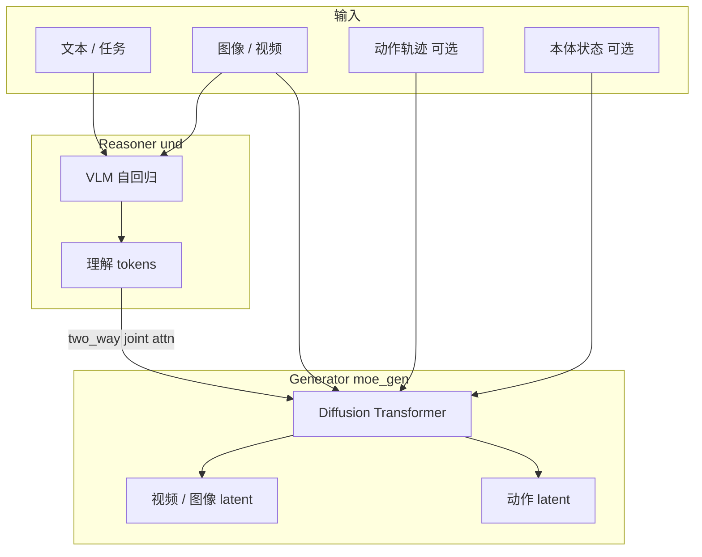

# Cosmos3 网络结构（聚焦 Edge）

个人 lab 笔记，用来理解我们后训练改的是什么。不能替代 NVIDIA 论文/官方文档；
与本机所用的 `cosmos-framework` Edge 配置对齐。

更细的 **Attention / `*_moe_gen` / Vision 训哪些**：见 [`MOT_ATTENTION_AND_VISION_SFT.md`](MOT_ATTENTION_AND_VISION_SFT.md)。

## 一句话

Cosmos3 是 **Mixture-of-Transformers（MoT）** 全模态模型：

- **Reasoner 塔（und）** —— 自回归 VLM，做理解（文本 / 图像 / 视频上下文）。
- **Generator 塔（gen / `moe_gen`）** —— 扩散（rectified flow），生成连续模态
  （视频 / 图像 / 动作；声音可选）。

文本走 next-token 解码；视频与动作靠迭代去噪合成。
`joint_attn_implementation = "two_way"` 用交叉注意力耦合两条通路。

## 结构图



## Cosmos3-Edge 要点

| 项 | Edge |
|----|------|
| 规模 | ~4B，面向边缘 |
| Backbone | **Nemotron-2B-Dense-VL**（不是 Nano/Super 用的 Qwen3-VL） |
| 视频编解码 | **Wan2.2 VAE**（像素 ↔ latent） |
| 默认分辨率 | ~480 |
| 我们关心的开关 | `vision_gen`、`action_gen`（默认关 `sound_gen`） |

Framework 指针：

- MoT：`cosmos_framework/model/generator/mot/`
- Omni 外壳：`cosmos_framework/model/generator/omni_mot_model.py`
- Edge 基线：`cosmos_framework/configs/base/experiment/sft/models/edge_model_config.py`

## 模态通路

```
像素 ──Wan VAE──► 视频 latent ──► Generator（扩散）
文本 / 指令 ───────────────► Reasoner（tokens）
关节 ──action2llm──► 动作 tokens/latents ──► Generator
                 ◄──llm2action── 投影回 6D / …
```

| 模块名 | 作用 |
|--------|------|
| `moe_gen` | Generator 塔参数（Vision SFT 主要目标） |
| `vae2llm` / `llm2vae` | 视频 latent ↔ LM 空间 |
| `time_embedder` | 扩散时间步 |
| `k_norm_und_for_gen` | gen→und 交叉注意力上的 und-K 归一化 |
| `action2llm` / `llm2action` / `action_modality_embed` | 动作通路（Action-Policy） |

动作维度随本体而异（SO-101 = **6D**），在 framework 里 pad 到 `max_action_dim=64`。

## 如何映射到我们的两条 SFT

| 轨道 | 网络用法 | 我们训什么 |
|------|----------|------------|
| Vision SFT | 世界 / 视频通路；关掉动作数据 | 对选定 gen 模块做 Full FT（`keys_to_select`） |
| Action-Policy SFT | WAM：视觉 + 状态 → 动作块 | 动作头（+ 配方允许的 gen 模块） |

同一 MoT checkpoint 家族；通路与 `keys_to_select` / 数据不同。

## 对比 π0（lab 基线）

| | Cosmos3 WAM | π0 |
|--|-------------|-----|
| 结构 | Reasoner + 扩散 Generator（视频 + 动作） | 视觉→动作策略 |
| 输出 | 视频和/或动作 | 主要是动作 |
| 我们的用法 | Edge Vision / Action 后训练 | LeRobot stack3cam 策略 |
