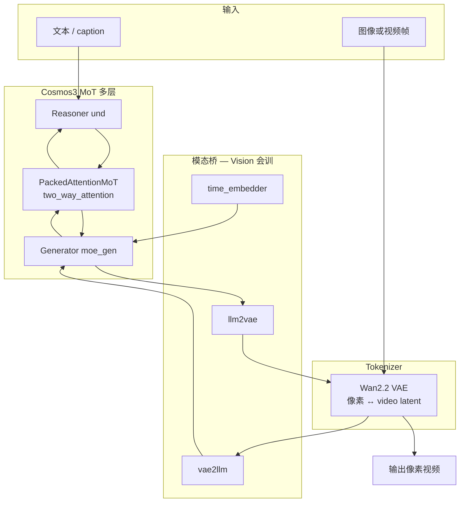
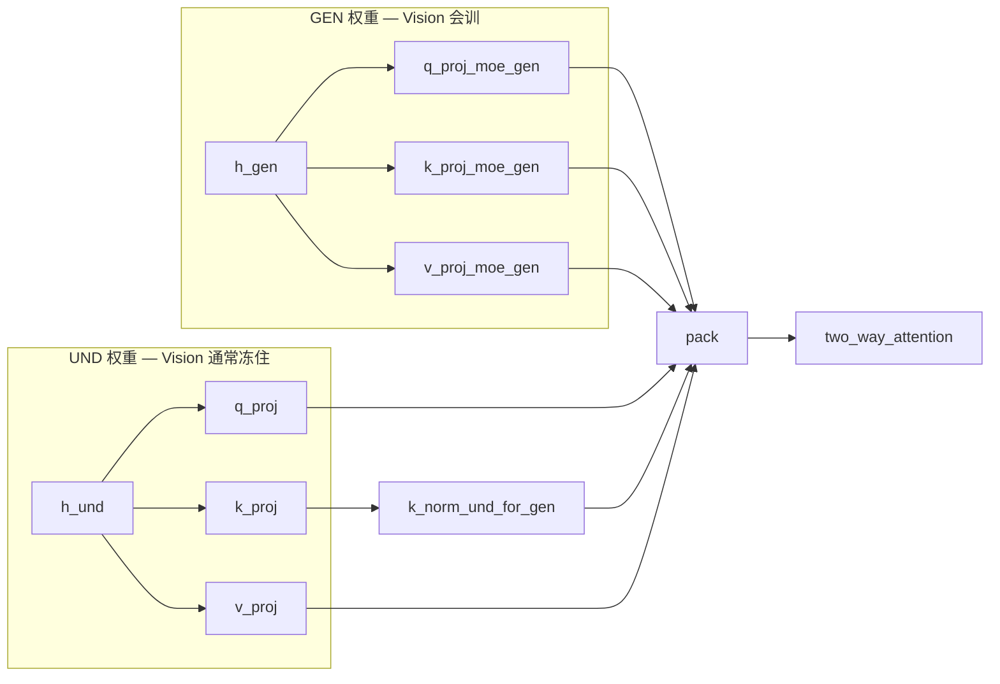
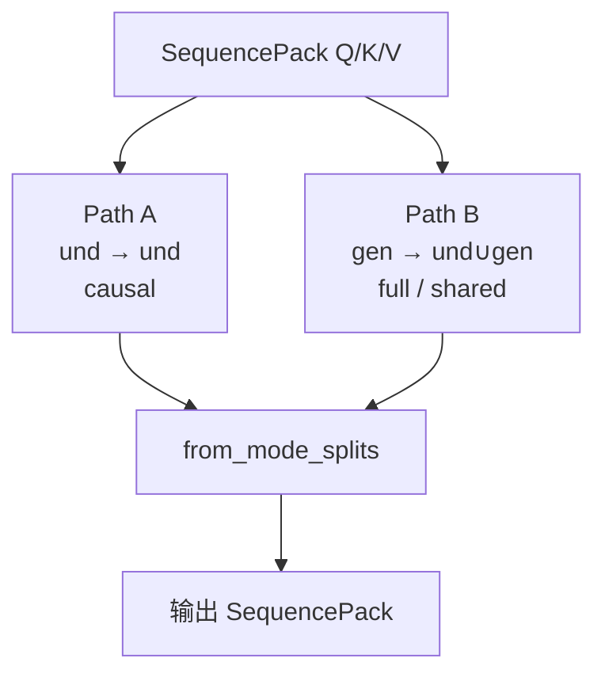

# Cosmos3 MoT 网络结构、Attention 与 Vision SFT 小结

> 仓库：[`upnana/cosmos-edge-lab`](https://github.com/upnana/cosmos-edge-lab)  
> 引擎：本地 `cosmos-framework`  
> 对应配方：`configs/vision_sft_edge.toml`（`action_gen=False`）

本文汇总：**整网逻辑、und/gen、`*_moe_gen`、`two_way_attention`、Vision SFT 到底在调哪**。  
相关实验记录见 [`VISION_SMOKE_EXPORT_I2V.md`](VISION_SMOKE_EXPORT_I2V.md)、[`VISION_500_HELDOUT_I2V.md`](VISION_500_HELDOUT_I2V.md)。

---

## 1. 一句话总览

Cosmos3-Edge 是 **Mixture-of-Transformers（MoT）**：

- **und（understanding / Reasoner）**：看懂文本、图像条件  
- **gen（`moe_gen` / Generator）**：扩散去噪，生成视频 latent  

Vision SFT：**前向两条通路都跑；反传主要只更新 gen 侧**（外加少量桥接模块）。

---

## 2. 整网逻辑（Vision，无 action）



| 模块 | 角色 |
|------|------|
| Wan VAE | 像素 ↔ latent（权重文件加载；不训 Wan TI2V-5B） |
| und | 理解条件 |
| gen / `*_moe_gen` | 生成视频动力学 |
| `vae2llm` / `llm2vae` | latent ↔ LM 空间 |
| `time_embedder` | 扩散时间步 |

**当前 Vision 配方强制 `action_gen=False`**：不读、不预测 6D 关节。

---

## 3. und 是什么？

**und = understanding（理解通路）**，与 **gen（生成通路）** 成对：

| 简称 | 含义 | 干什么 |
|------|------|--------|
| **und** | understanding / Reasoner | 看懂文本、图像、视频条件（自回归 VLM） |
| **gen** | generator / `moe_gen` | 扩散去噪，生成视频（或动作）latent |

代码里：`get_und_seq` = 取理解侧 token；不带 `_moe_gen` 后缀的 `q_proj` 等 = und 权重。

---

## 4. `*_moe_gen` 是什么结构？

**命名后缀**，标记 **Generator 塔** 的并行权重；**不是**另挂一个外部模型。

每一层 `MoTDecoderLayer` 有两套同构子模块：

| und（无后缀） | gen（`*_moe_gen`） |
|---------------|---------------------|
| `q/k/v/o_proj` | `q/k/v/o_proj_moe_gen` |
| `q_norm` / `k_norm` | `q_norm_moe_gen` / `k_norm_moe_gen` |
| `input_layernorm` | `input_layernorm_moe_gen` |
| `post_attention_layernorm` | `post_attention_layernorm_moe_gen` |
| `mlp` | `mlp_moe_gen` |

代码位置：`cosmos_framework/model/generator/mot/unified_mot.py`

- `PackedAttentionMoT`：双通路注意力投影  
- `MoTDecoderLayer`：一层完整 und/gen  

### Edge（Nemotron Dense）上的注意点

名字来自 **Mixture-of-Transformers**。  
在 **Cosmos3-Edge Dense** 上，`mlp_moe_gen` 一般是 **普通 MLP**，不是 Sparse MoE 路由；  
真 Sparse MoE 出现在部分 Qwen3-VL-MoE 配置。

一层 gen 前向：

```text
gen token
  → input_layernorm_moe_gen
  → q/k/v_proj_moe_gen → (q/k_norm_moe_gen) → two_way_attention → o_proj_moe_gen
  → + residual
  → post_attention_layernorm_moe_gen
  → mlp_moe_gen
  → + residual
```

---

## 5. 不同 modality 的 Q/K/V 怎么“就算”

**不是一套 QKV 混所有模态**，而是 **und / gen 各算一套，再 pack**：

```text
h_und ── q_proj / k_proj / v_proj ──────────────► Q_und, K_und, V_und
h_gen ── q/k/v_proj_moe_gen ────────────────────► Q_gen, K_gen, V_gen

（可选）K_und ── k_norm_und_for_gen ──► K_und_for_gen   # 仅给 gen 看 und 时用

再 from_und_gen_splits → SequencePack → two_way_attention
```



---

## 6. `two_way_attention` 怎么实现

文件：`cosmos_framework/model/generator/mot/attention.py` → `two_way_attention`

**不是一次大混合 softmax**，而是：**拆开 → 打两次 attention → 拼回**。

```text
① 选 K：gen 可用 normalized K；und 自注意力用 raw K
② 切开：
   get_causal_seq     → und
   get_full_only_seq  → gen 的 Q
   get_all_seq        → und+gen 的 K/V
③ Path A：attention(Q_und, K_und, V_und, causal=True)
④ Path B：attention(Q_gen, K_all, V_all)   # full，shared
⑤ from_mode_splits → 按原 pack 布局写回
```



| | Path A | Path B |
|--|--------|--------|
| Query | und | gen |
| Key/Value | 仅 und | **und + gen** |
| 掩码 | causal | full |
| und-K | raw | 常经 `k_norm_und_for_gen` |
| Vision 谁更新 | und 的 `q/k/v_proj` **不训** | `*_moe_gen` **训**；`k_norm_und_for_gen` **训** |

`two_way_attention` / `pack` **本身没有可学习参数**；可学权重在前面的投影层。

---

## 7. Vision SFT 到底在调哪

配置：`configs/vision_sft_edge.toml`

```toml
joint_attn_implementation = "two_way"   # 前向会跑 shared attention

keys_to_select = [
    "moe_gen",               # Generator 整塔（含 *_moe_gen）
    "time_embedder",
    "vae2llm",
    "llm2vae",
    "k_norm_und_for_gen",    # gen 看 und 时对 und-K 的 RMSNorm
]
```

冻结实现：`cosmos_framework/utils/generator/optimizer.py` → `_build_params_with_metadata`  
（名字不含上述子串 → `requires_grad=False`）

| 部分 | 前向 | Vision 反传 |
|------|------|-------------|
| `*_moe_gen`（attn + MLP + gen norm） | ✅ | **训** |
| `time_embedder` / `vae2llm` / `llm2vae` | ✅ | **训** |
| `k_norm_und_for_gen` | ✅（Path B） | **训** |
| und 主干 / und 自注意力 | ✅ | **冻** |
| action 头 | 关 | 不训 |
| `two_way_attention` 函数 | ✅ | 无独立权重 |

一句话：**Path A 看懂（冻住），Path B 画画（主要训 `*_moe_gen` + 一点点 `k_norm_und_for_gen`）。**  
不是“没走 shared attention”，而是“shared 当固定接口，主要训 Generator 一侧”。

---

## 8. Loss：无 action vs 有 action

### Vision（当前）

\[
L = L_{\text{video}} \times \text{loss\_scale}
\]

监督 = 视频 latent 扩散（rectified flow）；`loss_scale` 常见为 10。

### Action-Policy（另一条配方）

\[
L = L_{\text{video}}\times\text{loss\_scale}
  + L_{\text{action}}\times\text{action\_loss\_weight}
\]

额外训 `action2llm` / `llm2action` / `action_modality_embed` 等。  
实现：`omni_mot_model.py` → `_compute_losses`。

---

## 9. 代码索引（建议阅读顺序）

| 主题 | 路径 |
|------|------|
| Lab 超参 / `keys_to_select` | `configs/vision_sft_edge.toml` |
| Framework experiment | `cosmos_framework/configs/base/experiment/sft/vision_sft_edge.py` |
| 冻结逻辑 | `cosmos_framework/utils/generator/optimizer.py` |
| und/gen 投影与一层结构 | `.../mot/unified_mot.py`（`PackedAttentionMoT` / `MoTDecoderLayer`） |
| two_way 实现 | `.../mot/attention.py` → `two_way_attention` |
| Loss | `.../omni_mot_model.py` → `_compute_losses` |

---

## 10. 和本 lab 实验的关系

- Smoke 10 iter / 正经 500 iter：都是上述 Vision 机制  
- 导出后 I2V：测的是 **世界模型视频生成**，不是关节策略  
- 要“会动手”：另跑 Action-Policy（`configs/action_policy_so101_edge.toml`）

更多架构笔记：[`COSMOS_ARCHITECTURE.md`](COSMOS_ARCHITECTURE.md)、[`VISION_VS_ACTION_SFT.md`](VISION_VS_ACTION_SFT.md)、[`FULL_SFT_VS_LORA.md`](FULL_SFT_VS_LORA.md)。
