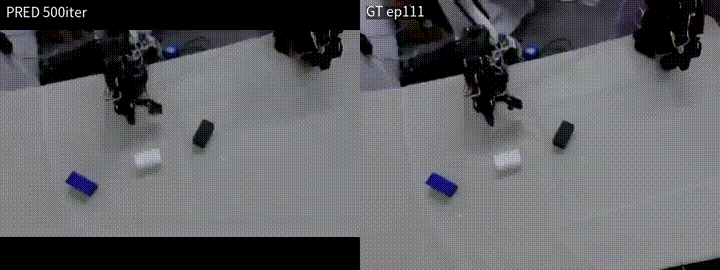
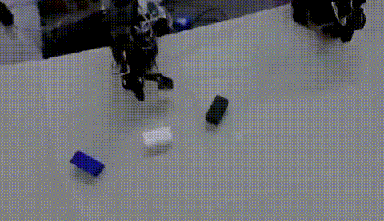
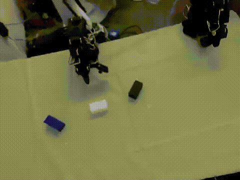
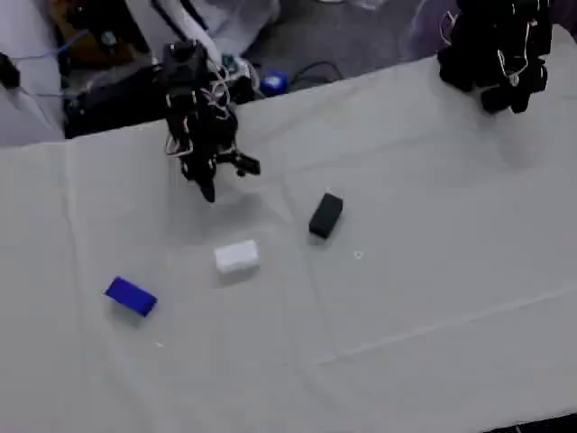

# Vision SFT 500 → 导出 → Held-out I2V（ep111）

> 日期：2026-08-10  
> job：`stack3cam_vision_sft_edge_500`（500 iter）  
> 评测 episode：**111**（val / held-out，不在 train 108 条内）

**结论定位：** 相对 10-iter smoke，这是第一版「正经」Vision 后训练评测；仍只看定性视频，不宣称叠块能力 SOTA。

---

## 0. 打开本页即可预览（PRED vs GT）

### 并排（左 PRED 500iter / 右 GT ep111，约 2s）

<video src="assets/vision_heldout_ep111/pred_vs_gt_2s.mp4" controls width="960" preload="metadata">
  <a href="assets/vision_heldout_ep111/pred_vs_gt_2s.mp4">pred_vs_gt_2s.mp4</a>
</video>

### 预测（held-out I2V）

<video src="assets/vision_heldout_ep111/pred_i2v_heldout_ep111.mp4" controls width="720" preload="metadata">
  <a href="assets/vision_heldout_ep111/pred_i2v_heldout_ep111.mp4">pred_i2v_heldout_ep111.mp4</a>
</video>

### GT（同 episode front，约 2s）

<video src="assets/vision_heldout_ep111/gt_front_2s.mp4" controls width="720" preload="metadata">
  <a href="assets/vision_heldout_ep111/gt_front_2s.mp4">gt_front_2s.mp4</a>
</video>

条件首帧：

更长 GT：[gt_front_8s.mp4](assets/vision_heldout_ep111/gt_front_8s.mp4)

---

## 1. 流水线状态

| 阶段 | 状态 | 路径 |
|------|------|------|
| Vision SFT 500 | 完成 | `outputs/cosmos3/sft/stack3cam_vision_sft_edge_500/checkpoints/iter_000000500` |
| 导出 HF | 完成 | `outputs/export/vision_stack3cam_vision_sft_edge_500` |
| Held-out I2V | 完成 | `outputs/eval_vision_heldout/i2v_out/i2v_heldout_ep111/vision.mp4` |
| 本仓库预览资产 | 已整理 | [`docs/assets/vision_heldout_ep111/`](assets/vision_heldout_ep111/) |

一键脚本：[`scripts/run_vision_500_then_heldout_i2v.sh`](../scripts/run_vision_500_then_heldout_i2v.sh)

日志：`outputs/logs/vision_500_pipeline.nohup.log`

---

## 2. 为什么是 held-out ep111

既有 Vision JSONL：`train` 108 / `val` 12。  
Val episode：`3,22,25,30,47,57,59,69,73,99,103,111`。

- Smoke 用过 **ep119**（在 train 内）→ 偏乐观  
- 本评测用 **ep111**（仅在 val）→ 测未见过轨迹上的 I2V

---

## 3. I2V 设定

| 项 | 值 |
|----|-----|
| 模式 | `image2video` |
| 条件 | ep111 front 首帧 |
| 帧数 / fps | 49 / 24（~2.04s） |
| 分辨率 | 832×480（推理 `--resolution 480`） |
| guidance / shift / seed | 6.0 / 5.0 / 0 |
| guardrails | 关闭（`--no-guardrails`） |

输入 JSON：[i2v_heldout_ep111.json](assets/vision_heldout_ep111/i2v_heldout_ep111.json)

---

## 4. 肉眼观察（500 iter）

相对 10-iter smoke：场景身份通常更稳（桌面、三色块、夹爪）。  
相对 GT：仍难复现完整抓取/叠放时序；2s 窗口也短于真实 teleop 全程。

更细对比请直接看第 0 节并排视频。

---

## 5. 与 smoke 文档关系

- Smoke（ep119）：[`VISION_SMOKE_EXPORT_I2V.md`](VISION_SMOKE_EXPORT_I2V.md)  
- 本页：500 iter + **held-out ep111**
