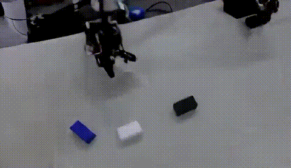
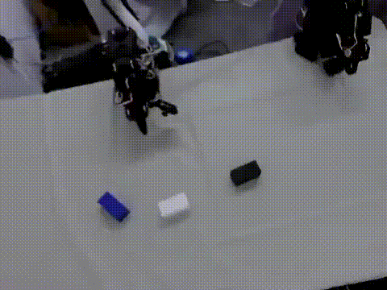
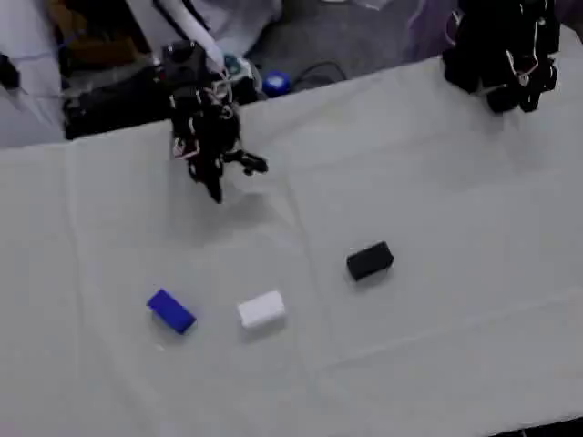

# Vision Smoke → 导出 → I2V 流水线记录

> 日期：2026-08-10  
> 机器：`july-R5300-G5`（1×H100 80GB）  
> 仓库：[`upnana/cosmos-edge-lab`](https://github.com/upnana/cosmos-edge-lab)  
> 训练引擎：本地 [`cosmos-framework`](https://github.com/NVIDIA/cosmos-framework)（外部依赖，默认 `../cosmos-framework`）

本文记录一次 **Cosmos3-Edge Vision SFT smoke（10 iter）→ DCP 导出 HF safetensors → Image-to-Video（I2V）** 的完整链路，并标明 **SFT 配置、被训练模块与代码对应关系**，以及 **预测视频 vs GT 视频**。

**重要结论：** 10 iter 只验证管线可跑通，**不能**当作叠方块世界模型能力证据。

---

## 0. 打开本页即可预览（预测 vs GT）

> 直接打开本 Markdown 页面即可浏览；无需点进单独的 `.mp4` 文件页。  
> GitHub 对大体积 / 非 baseline H.264 的 blob 预览常失败，故此处用 **页内 GIF + 小体积 mp4**。

### 预测（I2V smoke，ep119 首帧条件）



<video src="assets/vision_smoke_i2v/pred_i2v_vision_smoke.mp4" controls width="720" preload="metadata">
  你的浏览器不支持 video 标签；请看上方 GIF，或下载
  <a href="assets/vision_smoke_i2v/pred_i2v_vision_smoke.mp4">pred_i2v_vision_smoke.mp4</a>
</video>

### GT（同 episode front，对齐约 2s）



<video src="assets/vision_smoke_i2v/gt_episode_000119_front_2s.mp4" controls width="720" preload="metadata">
  你的浏览器不支持 video 标签；请看上方 GIF，或下载
  <a href="assets/vision_smoke_i2v/gt_episode_000119_front_2s.mp4">gt_episode_000119_front_2s.mp4</a>
</video>

条件首帧：



更长 GT 对照：[gt_episode_000119_front_8s.mp4](assets/vision_smoke_i2v/gt_episode_000119_front_8s.mp4)

---

## 1. 总览

```text
LeRobot stack3cam (front)
        │ prepare_vision_data / 已有 JSONL
        ▼
Vision SFT smoke (10 iter)     ← configs/vision_sft_edge.toml
        │ DCP ckpt
        ▼
export_model → HF safetensors  ← outputs/export/vision_smoke_010
        │
        ▼
inference (image2video)        ← ep119 首帧 + 任务 caption
        ▼
pred vision.mp4  ↔  GT front clip
```

| 阶段 | 产物（本机绝对路径） |
|------|----------------------|
| Smoke 训练 ckpt | `outputs/cosmos3/sft/stack3cam_vision_sft_edge/checkpoints/iter_000000010` |
| 导出 HF | `outputs/export/vision_smoke_010`（~6.3G，git 忽略） |
| I2V 条件帧 | `outputs/eval_vision_smoke/first_frame.png` |
| I2V 输入 JSON | `outputs/eval_vision_smoke/i2v_stack3cam.json` |
| 预测视频 | `outputs/eval_vision_smoke/i2v_out/i2v_stack3cam/vision.mp4` |
| 本仓库可下载样例 | [`docs/assets/vision_smoke_i2v/`](assets/vision_smoke_i2v/) |

---

## 2. SFT 配置（`sft_config`）与加载链

### 2.1 配置如何接到训练引擎

```text
configs/vision_sft_edge.toml          ← lab 超参源（你改这里）
        │ launch_vision_sft.sh 复制
        ▼
examples/toml/sft_config/vision_sft_edge_lab.toml
        │ _sft_launcher_common.sh → torchrun train
        ▼
load_experiment_from_toml(...)        ← cosmos_framework/configs/toml_config/sft_config.py
        │ 覆盖 Hydra experiment
        ▼
experiment=vision_sft_edge            ← configs/base/experiment/sft/vision_sft_edge.py
        │ model.config =
        ▼
EDGE_MODEL_CONFIG                     ← .../sft/models/edge_model_config.py
（Nemotron-2B-Dense-VL / Cosmos3-Edge；本配方强制 action_gen=False）
```

### 2.2 Lab 侧 TOML（真正改超参的地方）

- Lab：[`configs/vision_sft_edge.toml`](../configs/vision_sft_edge.toml)
- 启动：[`scripts/launch_vision_sft.sh`](../scripts/launch_vision_sft.sh)  
  会把 TOML 复制到  
  `$COSMOS_FRAMEWORK_ROOT/examples/toml/sft_config/vision_sft_edge_lab.toml`，  
  并写一个 `examples/launch_sft_vision_edge_lab.sh`（保证 `_sft_launcher_common.sh` 的 WORKDIR 正确）。

### 2.3 Framework 侧 experiment / 模型配置

| 角色 | 路径 |
|------|------|
| Hydra experiment 名 | `vision_sft_edge` |
| Experiment 定义 | `cosmos_framework/configs/base/experiment/sft/vision_sft_edge.py` |
| TOML→experiment | `cosmos_framework/configs/toml_config/sft_config.py` → `load_experiment_from_toml` |
| Edge 模型字典 | `.../sft/models/edge_model_config.py` → `EDGE_MODEL_CONFIG` |
| 训练入口 | `python -m cosmos_framework.scripts.train` |

注意：framework 默认 `optimizer.lr=5e-4`；**lab TOML 写成 `1e-4`**，以 lab 为准。

### 2.4 本次 smoke 实际生效的关键项

| 项 | TOML / 默认 | Smoke 覆盖 |
|----|-------------|------------|
| `job.experiment` | `vision_sft_edge` | 同左 |
| `job.name` | `stack3cam_vision_sft_edge` | 同左 |
| `trainer.max_iter` | 500 | **10**（`EXTRA_TAIL_OVERRIDES`） |
| `checkpoint.save_iter` | 100 | **10** |
| `trainer.grad_accum_iter` | TOML=2；launcher 再写 4 | **4** |
| `optimizer.lr` | `1e-4` | 同左 |
| `model.compile.enabled` | `false` | 同左（避免 cold start） |
| `checkpoint.load_path` | `$BASE_CHECKPOINT_PATH` → lab DCP | `checkpoints/Cosmos3-Edge-dcp` |
| 数据 | `$DATASET_PATH` | `data/processed/stack3cam_vision_sft`（~108 clips，symlink 到 framework 已转好的 JSONL） |
| VAE | `$WAN_VAE_PATH` | `Wan2.2_VAE.pth`（仅 tokenizer，不训 Wan TI2V-5B） |

Smoke 启动：

```bash
cd /home/july/cosmos-edge-lab
source scripts/env.sh
export EXTRA_TAIL_OVERRIDES="trainer.max_iter=10 checkpoint.save_iter=10"
export NPROC_PER_NODE=1
bash scripts/launch_vision_sft.sh
```

训练结果（摘要）：约 10 iter 完成，loss ~1.56；日志 `outputs/logs/smoke_vision_sft.log`。

---

## 3. SFT 训的是哪些模块？对应哪段代码？

Edge Vision 配方是 **生成通路模块级 full SFT**（不是 LoRA；LoRA 是 Super 档 `vision_sft_super`）。  
`optimizer.keys_to_select` 决定哪些参数名子串进优化器：

```toml
# configs/vision_sft_edge.toml
keys_to_select = [
    "moe_gen",
    "time_embedder",
    "vae2llm",
    "llm2vae",
    "k_norm_und_for_gen",
]
```

| `keys_to_select` | 含义 | 对应代码（`cosmos-framework` 内） |
|------------------|------|-----------------------------------|
| `moe_gen` | MoT 生成塔权重（`*_moe_gen`：Q/K/V/O、MLP、layernorm 等） | `model/generator/mot/unified_mot.py` → `PackedAttentionMoT` / `MoTDecoderLayer`（如 `q_proj_moe_gen`、`mlp_moe_gen`） |
| `time_embedder` | 扩散时间步嵌入 | `mot/modeling_utils.py` → `class TimestepEmbedder`；在 `mot/cosmos3_vfm_network.py` 挂载为 `self.time_embedder` |
| `vae2llm` | VAE latent → LLM hidden | `cosmos3_vfm_network.py`：`self.vae2llm = nn.Linear(...)` |
| `llm2vae` | LLM hidden → VAE latent | 同上：`self.llm2vae = nn.Linear(...)` |
| `k_norm_und_for_gen` | und→gen 交叉注意力前的 und-K RMSNorm | `unified_mot.py` → `PackedAttentionMoT.k_norm_und_for_gen` |

训练/推理外壳：

| 角色 | 路径 |
|------|------|
| OmniMoT 训练模型 | `cosmos_framework/model/generator/omni_mot_model.py` → `OmniMoTModel` |
| Edge VFM 网络组装 | `cosmos_framework/model/generator/mot/cosmos3_vfm_network.py` |
| Wan2.2 VAE 接口 | `cosmos_framework/model/generator/tokenizers/wan2pt2_vae_4x16x16.py` |
| 导出 | `python -m cosmos_framework.scripts.export_model` |
| 推理 | `python -m cosmos_framework.scripts.inference` |

**刻意不训：** und/reasoner 主干（除与 gen 绑定的 `k_norm_und_for_gen`）、Wan TI2V-5B 视频大模型（只用 VAE 权重文件）。

更细的架构说明见 [`COSMOS_ARCHITECTURE.md`](COSMOS_ARCHITECTURE.md)、[`FULL_SFT_VS_LORA.md`](FULL_SFT_VS_LORA.md)。

---

## 4. 导出（DCP → HF safetensors）

```bash
cd /home/july/cosmos-framework
source .venv/bin/activate
export LD_LIBRARY_PATH=$(echo .venv/lib/python*/site-packages/nvidia/cu13/lib)

RUN_DIR=/home/july/cosmos-edge-lab/outputs/cosmos3/sft/stack3cam_vision_sft_edge
CKPT=$RUN_DIR/checkpoints/iter_000000010
EXPORT=/home/july/cosmos-edge-lab/outputs/export/vision_smoke_010

python -m cosmos_framework.scripts.export_model \
  --checkpoint-path "$CKPT" \
  --config-file "$RUN_DIR/config.yaml" \
  --parallelism-preset=latency \
  --no-use-torch-compile \
  --no-use-cuda-graphs \
  -o "$EXPORT"
```

导出目录自包含：`model-*-of-*.safetensors` + `vision_encoder/` + tokenizer/processor；`export_manifest.json` 记录 bundling 来源。日志：`outputs/logs/export_vision_smoke.log`。

---

## 5. I2V 推理（smoke eval）

### 5.1 条件与输入

- **条件图：** episode `000119` front 首帧（从训练 JSONL 同源 clip 抽帧）  
  `ffmpeg -i .../episode_000119_clip000.mp4 -vf "select=eq(n\,0)" -vframes 1 first_frame.png`
- **模式：** `image2video`
- **Prompt：** 与 Vision SFT caption 同风格的结构化 JSON（SO-101、白→蓝→黑叠块、静态第三人称前视）

仓库内副本（可直接在 GitHub / clone 后查看）：

- [`assets/vision_smoke_i2v/i2v_cond_first_frame.png`](assets/vision_smoke_i2v/i2v_cond_first_frame.png)
- [`assets/vision_smoke_i2v/i2v_stack3cam.json`](assets/vision_smoke_i2v/i2v_stack3cam.json)（`vision_path` 相对同目录首帧；本机复现推理时改为绝对路径）

### 5.2 命令

```bash
EXPORT=/home/july/cosmos-edge-lab/outputs/export/vision_smoke_010
IN=/home/july/cosmos-edge-lab/outputs/eval_vision_smoke/i2v_stack3cam.json
OUT=/home/july/cosmos-edge-lab/outputs/eval_vision_smoke/i2v_out

python -m cosmos_framework.scripts.inference \
  --parallelism-preset=latency \
  --no-use-torch-compile \
  --no-use-cuda-graphs \
  --no-guardrails \
  --checkpoint-path "$EXPORT" \
  -i "$IN" \
  -o "$OUT" \
  --resolution 480 \
  --num-frames 49 \
  --fps 24 \
  --shift 5.0 \
  --guidance 6.0 \
  --seed 0
```

说明：`--no-guardrails` 因 Guardrail 需额外 HF 下载，离线环境会失败；本 smoke 评估关掉了。

### 5.3 预测结果规格

| 项 | 值 |
|----|-----|
| 文件 | `pred_i2v_vision_smoke.mp4` |
| 分辨率 | 832×480 |
| 帧数 / 时长 | 49 帧，~2.04s @24fps |
| 采样 | `num_steps=35`，`guidance=6`，`shift=5` |

---

## 6. 预测视频 vs GT 视频

同源 episode：**`episode_000119_clip000`**（front cam，任务：白→蓝→黑叠块）。  
**页内预览见第 0 节**（打开本文即可播）。

| | 预测（I2V smoke） | GT（真机 teleop） |
|--|-------------------|-------------------|
| 页内预览 | [GIF](assets/vision_smoke_i2v/pred_i2v_vision_smoke.gif) / [mp4 ~79KB](assets/vision_smoke_i2v/pred_i2v_vision_smoke.mp4) | [GIF](assets/vision_smoke_i2v/gt_episode_000119_front_2s.gif) / [mp4 ~59KB](assets/vision_smoke_i2v/gt_episode_000119_front_2s.mp4) |
| 更长对照 | — | [8s mp4](assets/vision_smoke_i2v/gt_episode_000119_front_8s.mp4) |
| 条件 | 首帧 + caption | 真实后续运动 |
| 用途 | 管线 smoke / 肉眼粗看 | 对照「真实臂与块如何动」 |

**肉眼观察（10 iter）：** 场景身份大体保持（桌面、三色块、夹爪），夹爪附近有轻微运动；**远未复现** GT 的抓取/叠放时序。这符合「只训了 10 step」的预期。

> 若单独打开旧版大体积 `.mp4` 的 blob 页，GitHub 可能提示 *can't show files that are this big*。请回到本文第 0 节，或打开已重编码的小体积 mp4 / GIF。

---

## 7. 复现清单（最短路径）

```bash
# 0) 环境
cd /home/july/cosmos-edge-lab && source scripts/env.sh
# 需已有：Wan VAE、Cosmos3-Edge DCP、Vision JSONL

# 1) Vision smoke
export EXTRA_TAIL_OVERRIDES="trainer.max_iter=10 checkpoint.save_iter=10"
bash scripts/launch_vision_sft.sh

# 2) 导出（见第 4 节）

# 3) 抽首帧 + 写 i2v JSON + inference（见第 5 节）
```

相关日志：

- `outputs/logs/smoke_vision_sft.log`
- `outputs/logs/export_vision_smoke.log`
- `outputs/logs/i2v_vision_smoke.log`

---

## 8. 下一步（能力向，而非管线向）

1. 去掉 smoke override，按 TOML 拉长 `max_iter`（先数百～上千，注意 ~120 ep 过拟合）。  
2. 用 **held-out** episode 做 I2V，不要只看训练集尾部 ep119。  
3. 需要可对比指标时再补简单的帧差 / clip 相似度；当前以定性视频为主。  
4. Action-Policy smoke 是另一条轨（见 [`VISION_VS_ACTION_SFT.md`](VISION_VS_ACTION_SFT.md)），不经过本 I2V 流程。
